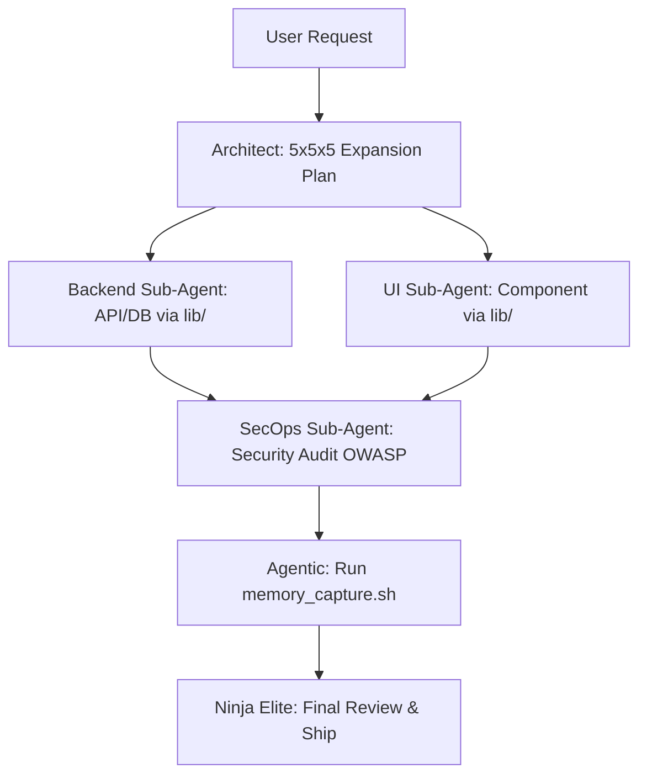

# 🥷 GUÍA DE ORQUESTACIÓN: SUB-AGENTES EN OPENCODE (v3.4)

Esta guía rescata y evoluciona el sistema de delegación de Ninja. Aunque Ninja v3.4 puede operar de forma autónoma (Modo 1), su verdadero poder se libera al orquestar un equipo de **Sub-Agentes Especializados** en terminales concurrentes de OpenCode (Modos 2 y 3).

---

## 🎭 Los 5 Perfiles de Sub-Agentes Ninja

Para maximizar la ventana de contexto de modelos gratuitos (Qwen, DeepSeek), Ninja aísla su conocimiento global (`lib/`, `rules/`) dividiéndolo en 5 sombreros:

### 1. Ninja Architect (The Orchestrator)
- **Carga Cognitiva**: `.agents/rules/core.md` (La regla 5x5x5) + `.agents/skills/saas_architecture.md`.
- **Misión**: Evaluar la petición inicial, investigar lo desconocido, aplicar el protocolo 5x5x5 y dividir el proyecto en piezas atómicas.
- **Comando de Invocación**: `/ninja-plan` (Ejecutado por Ninja Nivel 1).

### 2. Ninja UI/UX (The Visualist)
- **Carga Cognitiva**: `.agents/rules/frontend.md` + `lib/components`.
- **Misión**: Traducir los bloques del Architect en interfaces con Glassmorphism, Micro-interacciones GSAP y Tailwind 4. Cero lógica pesada.
- **Comando de Invocación**: `/ninja-ui` (Delegado a Terminal OpenCode).

### 3. Ninja Backend (The Logic)
- **Carga Cognitiva**: `.agents/rules/backend.md` + `lib/algorithms`.
- **Misión**: Levantar endpoints en Hono, contratos tRPC, migraciones Drizzle y gestionar BullMQ. Solo datos y seguridad interna.
- **Comando de Invocación**: `/ninja-logic` (Delegado a Terminal OpenCode).

### 4. Ninja SecOps (The Shield)
- **Carga Cognitiva**: `.agents/rules/security.md` + `lib/security`.
- **Misión**: Actuar como linter en vivo. Revisa el código de los demás agentes contra las normas OWASP y asegura que no haya tokens quemados.
- **Comando de Invocación**: `/ninja-secure` (Ejecutado al concluir una rama).

### 5. Ninja Agentic (The AI Integrator & Learner)
- **Carga Cognitiva**: `.agents/memory/` + `lib/snippets`.
- **Misión v3.4**: Es el encargado de integrar RAG, Vercel AI SDK, y sobre todo, ejecutar el script `memory_capture.sh` para cristalizar lo que el equipo aprendió en la sesión en aprendizajes permanentes.
- **Comando de Invocación**: `/ninja-ai` o `/ninja-absorb`.

---

## 🌊 Flujos de Trabajo Actualizados (Workflows v3.4)

### 🚀 Flujo A: El Scaffolding Inteligente
Usado para iniciar repositorios masivos en 3 minutos.
1. **El Usuario** solicita un SaaS (Modo 3).
2. **Architect** diseña el plan y aplica el *Protocolo 5x5x5* para proponer 5 mejoras disruptivas al repo inicial.
3. **Sub-Terminales** ejecutan en paralelo: Back levanta la DB, UI instala Aceternity.
4. **Agentic** actualiza `session_logs.md` con las nuevas decisiones.

### 🧪 Flujo B: Evolución de Features Complejas

---

## 💡 Consejos de Rendimiento para Modelos Gratuitos (Modo 2)
Para aprovechar la nueva Arquitectura v3.4 en OpenCode:
1. **No satures el contexto**: Si el UI Sub-Agent está trabajando, no le cargues el archivo de base de datos.
2. **Prompts Restrictivos**: Usa la instrucción `"Extrae el patrón de lib/snippets y úsalo, no inventes código"`. Esto elimina la alucinación de los modelos pequeños.
3. **Cierre de Ciclo Seguro**: Antes de hacer Commit, siempre pasa el código por el SecOps Sub-Agent. 

*La orquestación divide la inmensidad del software en piezas que cualquier IA puede resolver perfectamente.*
