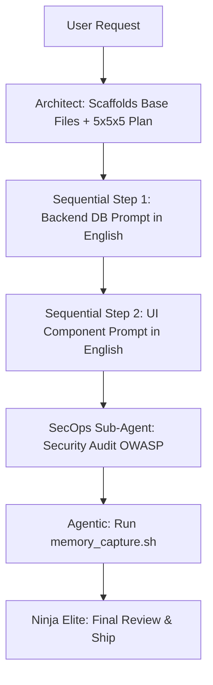

# 🥷 GUÍA DE ORQUESTACIÓN: SUB-AGENTES EN OPENCODE (v4.0)

Esta guía rescata y evoluciona el sistema de delegación de Ninja. Aunque Ninja v4.0 puede operar de forma autónoma (Modo 1), su verdadero poder se libera al orquestar un equipo de **Sub-Agentes Especializados** en terminales concurrentes de OpenCode (Modos 2 y 3).

---

## 🎭 Los 5 Perfiles de Sub-Agentes Ninja

Para maximizar la ventana de contexto de modelos gratuitos (Qwen, DeepSeek), Ninja aísla su conocimiento global (`lib/`, `rules/`) dividiéndolo en 5 sombreros:

### 1. Ninja Architect (The Orchestrator)
- **Carga Cognitiva**: `.agents/rules/core.md` (La regla 5x5x5) + `.agents/skills/saas_architecture.md`.
- **Misión v4.0**: Iniciar los desarrollos EXCLUSIVAMENTE dentro de la carpeta `proyectos/[Nombre_Proyecto]`. Diseñar planes ultra-extensos e impartir **Prompts Maestros en INGLÉS** de grado profesional para los sub-agentes, dictando claramente el directorio de trabajo y exigiendo logs para `/ninja-verify`. NUNCA DEBE GENERAR INSTRUCCIONES SIMPLES ni poner el nombre del modelo dentro del prompt (se pone arriba).
- **Comando de Invocación**: `/ninja-plan` u `/ninja-init`.

### 2. Ninja UI/UX (The Visualist)
- **Carga Cognitiva**: `.agents/rules/frontend.md` + `lib/components`.
- **Misión**: Traducir los bloques del Architect en interfaces con Glassmorphism, Micro-interacciones GSAP y Tailwind 4. Cero lógica pesada.
- **Comando de Invocación**: `/ninja-ui` (Delegado a Terminal OpenCode).

### 3. Ninja Backend (The Logic)
- **Carga Cognitiva**: `.agents/rules/backend.md` + `lib/algorithms`.
- **Misión**: Levantar endpoints en Hono, contratos tRPC, migraciones Drizzle y gestionar BullMQ. Solo datos y seguridad interna.
- **Comando de Invocación**: `/ninja-logic` (Delegado a Terminal OpenCode).

### 4. Ninja SecOps (The Shield)
- **Carga Cognitiva**: `.agents/rules/security.md` + `lib/security`.
- **Misión**: Actuar como linter en vivo. Revisa el código de los demás agentes contra las normas OWASP y asegura que no haya tokens quemados.
- **Comando de Invocación**: `/ninja-secure` (Ejecutado al concluir una rama).

### 5. Ninja Agentic (The AI Integrator & Learner)
- **Carga Cognitiva**: `.agents/memory/` + `lib/snippets`.
- **Misión v4.0**: Es el encargado de integrar RAG, Vercel AI SDK, y sobre todo, ejecutar el script `memory_capture.sh` para cristalizar lo que el equipo aprendió en la sesión en aprendizajes permanentes.
- **Comando de Invocación**: `/ninja-ai` o `/ninja-absorb`.

---

## 🌊 Flujos de Trabajo Actualizados (Workflows v4.0)

### 🚀 Flujo A: Scaffolding y Ejecución Secuencial
La regla de oro para evitar conflictos Git o sobrescritura de archivos en Modo Híbrido:
1. **El Usuario** solicita una aplicación (Modo 3).
2. **Architect (Antigravity)** diseña el plan, crea la carpeta `proyectos/[Nombre]/` y construye **TODA LA BASE DEL PROYECTO** (arquitectura de carpetas, dependencias base). **Solo el modelo principal hace esto.**
3. **La Delegación Estructurada:** Una vez completado el *Scaffolding*, el Architect genera los Prompts en Inglés. **Importante:** El modelo a usar se indica AFUERA del prompt (arriba). Dentro del prompt se le ordena al sub-agente ubicarse en `proyectos/[Nombre]/` y dejar un log en `.ninja-verify.md` de todo lo que haga.
4. **Orden Estricto de los Sub-Terminales:** Se dicta al usuario qué prompt ejecutar primero (ej. "Terminal 1: Corre este Prompt. Espera. Terminal 2: Corre el siguiente").
5. **Verificación:** Al finalizar todas las terminales, se ejecuta `/ninja-verify` en Antigravity para que lea el archivo `.ninja-verify.md` y compruebe el trabajo global.

### 🧪 Flujo B: Evolución de Features Complejas (Sin Conflictos)

---

## 💡 Consejos de Rendimiento para Modelos Gratuitos (Modo 2)
Para aprovechar la nueva Arquitectura v4.0 en OpenCode:
1. **Prompts Restrictivos y Extensos**: Usa la instrucción `"Extrae el patrón de lib/snippets y úsalo, no inventes código"`. Asegura que el prompt generado mida al menos 300 palabras cubriendo casos borde.
2. **Cierre de Ciclo Seguro**: Antes de hacer Commit, siempre pasa el código por el SecOps Sub-Agent. 

*La orquestación divide la inmensidad del software en piezas que cualquier IA puede resolver perfectamente evaluando costo y precisión.*
