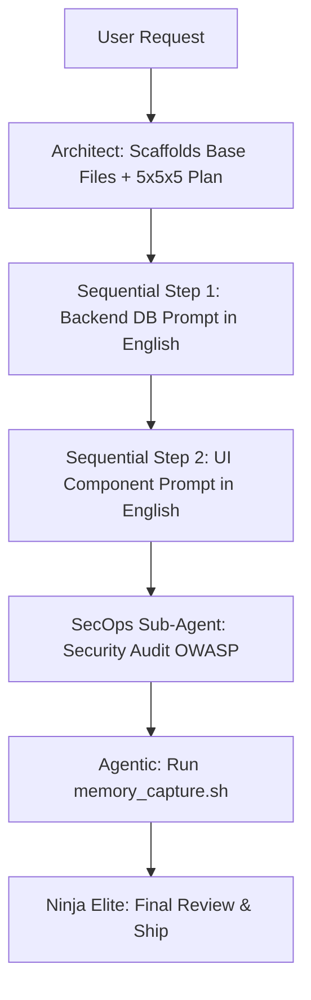

# 🥷 GUÍA DE ORQUESTACIÓN: SUB-AGENTES EN OPENCODE (v4.5)

Esta guía rescata y evoluciona el sistema de delegación de Ninja. En la versión 4.5, Ninja ya no solo dicta prompts; actúa como un **Asistente Proactivo** que automatiza la infraestructura y ensambla el código resultante. Escala o muere.

---

## 🎭 Los 5 Perfiles de Sub-Agentes Ninja

Para maximizar la ventana de contexto de modelos gratuitos (Qwen, DeepSeek), Ninja aísla su conocimiento global (`lib/`, `rules/`) dividiéndolo en 5 sombreros:

### 1. Ninja Architect (The Assistant)
- **Carga Cognitiva**: `.agents/rules/core.md` (Vertical de 25 puntos) + `.agents/skills/saas_architecture.md`.
- **Misión v4.5**: Iniciar los desarrollos EXCLUSIVAMENTE dentro de la carpeta `proyectos/[Nombre_Proyecto]`. Diseñar planos Deep SaaS, **crear los directorios automáticamente**, e impartir **Prompts Maestros** indicando el modelo exacto (DeepSeek, Gemma) desde `MODELOS_REGISTRADOS.md`. NUNCA DEBE GENERAR INSTRUCCIONES SIMPLES.
- **Comando de Invocación**: `/ninja-plan` u `/ninja-init`.

### 2. Ninja UI/UX (The Visualist)
- **Carga Cognitiva**: `.agents/rules/frontend.md` + `lib/components`.
- **Misión**: Traducir los bloques del Architect en interfaces con Glassmorphism, Micro-interacciones GSAP y Tailwind 4. Cero lógica pesada.
- **Comando de Invocación**: `/ninja-ui` (Delegado a Terminal OpenCode).

### 3. Ninja Backend (The Logic)
- **Carga Cognitiva**: `.agents/rules/backend.md` + `lib/algorithms`.
- **Misión**: Levantar endpoints en Hono, contratos tRPC, migraciones Drizzle y gestionar BullMQ. Solo datos y seguridad interna.
- **Comando de Invocación**: `/ninja-logic` (Delegado a Terminal OpenCode).

### 4. Ninja SecOps (The Shield)
- **Carga Cognitiva**: `.agents/rules/security.md` + `lib/security`.
- **Misión**: Actuar como linter en vivo. Revisa el código de los demás agentes contra las normas OWASP y asegura que no haya tokens quemados.
- **Comando de Invocación**: `/ninja-secure` (Ejecutado al concluir una rama).

### 5. Ninja Agentic (The AI Integrator & RAG Expert)
- **Carga Cognitiva**: `.agents/memory/` + `lib/snippets`.
- **Misión v4.5**: Encargado de integrar RAG (Vercel AI SDK). Si una librería es desconocida por `lib/`, este agente realiza la búsqueda y guarda el contexto local. Es el responsable de **Ensamblar y Unir** el código devuelto por los otros sub-agentes en el proyecto principal.
- **Comando de Invocación**: `/ninja-ai` o `/ninja-absorb`.

---

## 🌊 Flujos de Trabajo Actualizados (Workflows v4.0)

### 🚀 Flujo A: Scaffolding y Ejecución Secuencial Asistida
1. **Asistencia Inicial:** Ninja extrae requisitos y decide entre Demo o Producción.
2. **Architect (Antigravity):** Diseña el plan y **CREA LA CARPETA `proyectos/[Nombre]/`** de forma autónoma con los archivos base (`.env`, `docker-compose`, etc.).
3. **La Delegación:** Ninja genera los Prompts Maestros con la IA asignada arriba. El sub-agente escribe código puro.
4. **Integración Autónoma:** El usuario entrega el código a Antigravity y Ninja lo inyecta físicamente en el proyecto, verificando tipos y seguridad al instante.
5. **Verificación:** Ejecución de `/ninja-verify` para auditoría final.

### 🧪 Flujo B: Evolución de Features Complejas (Sin Conflictos)

---

## 💡 Consejos de Rendimiento para Modelos Gratuitos (Modo 2)
Para aprovechar la nueva Arquitectura v4.0 en OpenCode:
1. **Prompts Restrictivos y Extensos**: Usa la instrucción `"Extrae el patrón de lib/snippets y úsalo, no inventes código"`. Asegura que el prompt generado mida al menos 300 palabras cubriendo casos borde.
2. **Cierre de Ciclo Seguro**: Antes de hacer Commit, siempre pasa el código por el SecOps Sub-Agent. 

*La orquestación divide la inmensidad del software en piezas que cualquier IA puede resolver perfectamente evaluando costo y precisión.*
