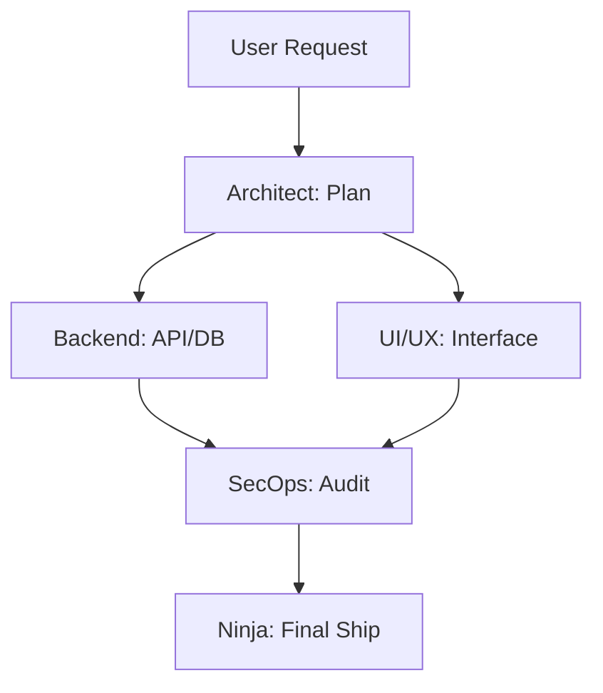

# 🥷 GUÍA DE FLUJOS NINJA: ORQUESTACIÓN MULTI-AGENTE en OPENCODE

Esta guía define el sistema de **Sub-Agentes Especializados** de Ninja. Cada sub-agente carga un fragmento específico del "Cerebro Ninja" grabado en `.agents/` para maximizar la precisión y eficiencia en OpenCode.

---

## 🎭 Roles y Sub-Agentes Ninja

Ninja opera mediante la delegación coordinada entre estos 5 perfiles:

### 1. Ninja Architect (The Orchestrator)
- **Conocimiento**: `.agents/rules/core.md` + `.agents/skills/saas_architecture.md`.
- **Misión**: Planificar la estructura del proyecto, elegir el stack y supervisar a otros agentes.
- **Comando**: `/ninja-plan`

### 2. Ninja UI/UX (The Visualist)
- **Conocimiento**: `.agents/rules/frontend.md` + `.agents/skills/ui_visuals.md` + `lib/components`.
- **Misión**: Crear interfaces premium, animaciones GSAP/Framer y layouts responsivos.
- **Comando**: `/ninja-ui`

### 3. Ninja Backend (The Logic)
- **Conocimiento**: `.agents/skills/backend_logic.md` + `lib/algorithms`.
- **Misión**: Implementar APIs, lógica de negocio, esquemas de DB (Drizzle) y colas (BullMQ).
- **Comando**: `/ninja-logic`

### 4. Ninja SecOps (The Shield)
- **Conocimiento**: `.agents/rules/security.md` + `lib/security`.
- **Misión**: Auditoría de código, endurecimiento de APIs y cumplimiento de OWASP.
- **Comando**: `/ninja-secure`

### 5. Ninja Agentic (The AI Expert)
- **Conocimiento**: `.agents/skills/ai_agentic.md` + `lib/snippets`.
- **Misión**: Integrar LLMs, flujos de n8n, RAG y automatizaciones complejas.
- **Comando**: `/ninja-ai`

---

## 🔄 Flujos de Trabajo (Workflows)

### 🌊 Flujo A: Creación desde Cero (Scaffolding)
1. **Architect** ejecuta `/ninja-init saas`.
2. **Backend** configura la base de datos y auth.
3. **UI/UX** inyecta el design system de Aceternity.
4. **SecOps** valida que no haya fugas de configuración.

### 🧪 Flujo B: Evolución de Feature

---

## ⌨️ Catálogo de Comandos a Profundidad

| Comando | Agente Responsable | Acción Detallada |
|---------|-------------------|------------------|
| `/ninja-init [type]` | Architect | Crea `src/`, inicializa Git, inyecta `.agents/` y elige boilerplate. |
| `/ninja-build [feature]` | Backend + UI | Implementación coordinada: API endpoint + Componente Frontend. |
| `/ninja-audit` | SecOps | Escaneo estático de código, chequeo de dependencias y reporte OWASP. |
| `/ninja-review` | Architect | Revisión cruzada de todos los archivos contra reglas R1-R12. |
| `/ninja-sync` | Agentic | Sincroniza `lib/` con las últimas versiones de los 130+ repos. |
| `/ninja-chat` | Agentic | Abre un flujo RAG buscando en `memory/master_index.md`. |

---

## 🧠 Conocimiento Compartido (The Cortex)
Todos los agentes tienen acceso a la carpeta **`lib/`**:
- Al usar `/ninja-logic`, el agente busca automáticamente en `lib/algorithms`.
- Al usar `/ninja-ui`, el agente busca automáticamente en `lib/components`.

---
*Ninja v3.1 — Inteligencia Distribuida para Ingeniería de Élite.*
